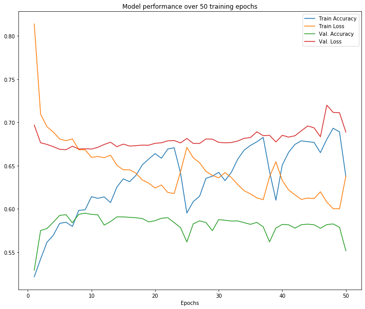

# Insights from "Helpful" Product Reviews
_Using NLP and neural networks to predict the "helpfulness" of a product review_

Many e-commerce sites offer users the opportunity to post their own reviews of products they have purchased. These reviews contain a wealth of information about users' experiences with a company's products, and other users may read these reviews when considering making a purchase. But because reviews consist mainly of user-generated text, it can be difficult for a business to extract insights from thousands of them. 

On some e-commerce sites, users have the opportunity to rate another user's product review as "helpful" or not, and analyzing these "helpful" reviews can help a business understand what its customers want to know about its products before buying. At the very least, being able to identify and promote potentially "helpful" reviews, even without directly analyzing their contents, could help potential customers get the information they need sooner.

This project aims to answer these two questions:

* What can we learn about a business's products and its customers from user-generated reviews that were rated "helpful" by other users?
* Can we predict whether a review will be rated "helpful" using machine learning or deep learning?

The [dataset I used for this project comes from Amazon (via Kaggle)](https://www.kaggle.com/snap/amazon-fine-food-reviews) and consists of over 500,000 reviews, mostly of food products, written between 2002 and 2012.

## Summary of findings

(For more, see _Interpretation, Recommendations, and Future Work_ below.)

* "Helpful" reviews are very difficult to distinguish from the rest using this dataset. 
* Using a neural network, "helpful" reviews can be identified with 59% accuracy on holdout data. This model could be used to sort submitted reviews so that the ones most likely to be "helpful" can be displayed first.
* "Helpful" reviews of food products reflect concerns about taste, ingredients, and packaging. Offering clearer information on these subjects in product descriptions could improve user experience.
* The most "helpful" _reviewers_ can be identified and offered incentives to review products. These reviewers tend to write many reviews and to rate products positively, so recognizing their contributions could be beneficial both to the business and to potential customers.

## Costs and benefits of this project

Any data science project can have costs and benefits, both in terms of resources like time and computing power, and in terms of the project's potential impact on human beings. Here is a summary of what I see as the pros and cons of the work I do here:

_Benefits_

* A business can learn about its products and customers.
* If a business improves its product or website based on things learned here, customers may have a better user experience, which could in turn lead to more and quicker conversions.

_Costs_

* Machine learning, and especially deep learning, can be costly in terms of labor, computing power, and energy use.
* The dataset consists of user-generated reviews, and some users could potentially be identified by their profile names or by information they provided in their reviews. Although users originally posted their reviews knowing that they would be publicly visible, they did not have the opportunity to choose whether their data would appear in this dataset. 

## About this repo

This repository contains the following files:

* **helpful_reviews_classification.ipynb**: a Jupyter Notebook containing the code for this project.
* **presentation.pdf**: PDF file containing slides from a non-technical presentation of project results

The full dataset can be downloaded at [https://www.kaggle.com/snap/amazon-fine-food-reviews](https://www.kaggle.com/snap/amazon-fine-food-reviews).

For more technical details, see the Appendix below.

<h1>Table of Contents<span class="tocSkip"></span></h1>
<div class="toc"><ul class="toc-item"><li><span><a href="#Introduction:-Insights-from-&quot;Helpful&quot;-Product-Reviews" data-toc-modified-id="Introduction:-Insights-from-&quot;Helpful&quot;-Product-Reviews-1"><span class="toc-item-num">1&nbsp;&nbsp;</span>Introduction: Insights from "Helpful" Product Reviews</a></span><ul class="toc-item"><li><span><a href="#Summary-of-findings" data-toc-modified-id="Summary-of-findings-1.1"><span class="toc-item-num">1.1&nbsp;&nbsp;</span>Summary of findings</a></span></li><li><span><a href="#Costs-and-benefits-of-this-project" data-toc-modified-id="Costs-and-benefits-of-this-project-1.2"><span class="toc-item-num">1.2&nbsp;&nbsp;</span>Costs and benefits of this project</a></span></li><li><span><a href="#Analysis-of-&quot;helpful&quot;-reviews" data-toc-modified-id="Analysis-of-&quot;helpful&quot;-reviews-2"><span class="toc-item-num">2&nbsp;&nbsp;</span>Analysis of "helpful" reviews</a></span><ul class="toc-item"><li><span><a href="#Load-data" data-toc-modified-id="Load-data-2.1"><span class="toc-item-num">2.1&nbsp;&nbsp;</span>Load data</a></span></li><li><span><a href="#Initial-exploration-and-cleaning" data-toc-modified-id="Initial-exploration-and-cleaning-2.2"><span class="toc-item-num">2.2&nbsp;&nbsp;</span>Initial exploration and cleaning</a></span><ul class="toc-item"><li><span><a href="#Check-for-duplicates" data-toc-modified-id="Check-for-duplicates-2.2.1"><span class="toc-item-num">2.2.1&nbsp;&nbsp;</span>Check for duplicates</a></span></li><li><span><a href="#Determine-how-to-handle-HelpfulnessNumerator" data-toc-modified-id="Determine-how-to-handle-HelpfulnessNumerator-2.2.2"><span class="toc-item-num">2.2.2&nbsp;&nbsp;</span>Determine how to handle <code>HelpfulnessNumerator</code></a></span></li><li><span><a href="#Calculate-lengths-of-reviews" data-toc-modified-id="Calculate-lengths-of-reviews-2.2.3"><span class="toc-item-num">2.2.3&nbsp;&nbsp;</span>Calculate lengths of reviews</a></span></li><li><span><a href="#Check-for-correlations-with-&quot;helpfulness&quot;" data-toc-modified-id="Check-for-correlations-with-&quot;helpfulness&quot;-2.2.4"><span class="toc-item-num">2.2.4&nbsp;&nbsp;</span>Check for correlations with "helpfulness"</a></span></li><li><span><a href="#View-the-most-and-least-&quot;helpful&quot;-reviews" data-toc-modified-id="View-the-most-and-least-&quot;helpful&quot;-reviews-2.2.5"><span class="toc-item-num">2.2.5&nbsp;&nbsp;</span>View the most and least "helpful" reviews</a></span></li><li><span><a href="#Meet-the-top-reviewers" data-toc-modified-id="Meet-the-top-reviewers-2.2.6"><span class="toc-item-num">2.2.6&nbsp;&nbsp;</span>Meet the top reviewers</a></span><ul class="toc-item"><li><span><a href="#The-most-prolific-reviewer" data-toc-modified-id="The-most-prolific-reviewer-2.2.6.1"><span class="toc-item-num">2.2.6.1&nbsp;&nbsp;</span>The most prolific reviewer</a></span></li><li><span><a href="#The-most-&quot;helpful&quot;-reviewer" data-toc-modified-id="The-most-&quot;helpful&quot;-reviewer-2.2.6.2"><span class="toc-item-num">2.2.6.2&nbsp;&nbsp;</span>The most "helpful" reviewer</a></span></li><li><span><a href="#Top-1%-most-&quot;helpful&quot;-reviewers" data-toc-modified-id="Top-1%-most-&quot;helpful&quot;-reviewers-2.2.6.3"><span class="toc-item-num">2.2.6.3&nbsp;&nbsp;</span>Top 1% most "helpful" reviewers</a></span></li><li><span><a href="#The-most-frequently-reviewed-product" data-toc-modified-id="The-most-frequently-reviewed-product-2.2.6.4"><span class="toc-item-num">2.2.6.4&nbsp;&nbsp;</span>The most frequently reviewed product</a></span></li></ul></li><li><span><a href="#Save-a-copy-of-the-data-for-modeling" data-toc-modified-id="Save-a-copy-of-the-data-for-modeling-2.2.7"><span class="toc-item-num">2.2.7&nbsp;&nbsp;</span>Save a copy of the data for modeling</a></span></li></ul></li><li><span><a href="#Analysis-with-NLP-techniques" data-toc-modified-id="Analysis-with-NLP-techniques-2.3"><span class="toc-item-num">2.3&nbsp;&nbsp;</span>Analysis with NLP techniques</a></span><ul class="toc-item"><li><span><a href="#Develop-an-analytical-workflow" data-toc-modified-id="Develop-an-analytical-workflow-2.3.1"><span class="toc-item-num">2.3.1&nbsp;&nbsp;</span>Develop an analytical workflow</a></span></li><li><span><a href="#Analyze-the-&quot;helpful&quot;-reviews" data-toc-modified-id="Analyze-the-&quot;helpful&quot;-reviews-2.3.2"><span class="toc-item-num">2.3.2&nbsp;&nbsp;</span>Analyze the "helpful" reviews</a></span><ul class="toc-item"><li><span><a href="#Look-at-bigrams" data-toc-modified-id="Look-at-bigrams-2.3.2.1"><span class="toc-item-num">2.3.2.1&nbsp;&nbsp;</span>Look at bigrams</a></span></li><li><span><a href="#Look-at-trigrams" data-toc-modified-id="Look-at-trigrams-2.3.2.2"><span class="toc-item-num">2.3.2.2&nbsp;&nbsp;</span>Look at trigrams</a></span></li></ul></li><li><span><a href="#Analyze-the-&quot;unhelpful&quot;-reviews" data-toc-modified-id="Analyze-the-&quot;unhelpful&quot;-reviews-2.3.3"><span class="toc-item-num">2.3.3&nbsp;&nbsp;</span>Analyze the "unhelpful" reviews</a></span></li><li><span><a href="#Visualize-&quot;helpful&quot;-and-&quot;unhelpful&quot;-reviews-using-t-SNE" data-toc-modified-id="Visualize-&quot;helpful&quot;-and-&quot;unhelpful&quot;-reviews-using-t-SNE-2.3.4"><span class="toc-item-num">2.3.4&nbsp;&nbsp;</span>Visualize "helpful" and "unhelpful" reviews using t-SNE</a></span></li></ul></li></ul></li><li><span><a href="#Predicting-&quot;helpfulness&quot;" data-toc-modified-id="Predicting-&quot;helpfulness&quot;-3"><span class="toc-item-num">3&nbsp;&nbsp;</span>Predicting "helpfulness"</a></span><ul class="toc-item"><li><span><a href="#Reload-and-split-the-data" data-toc-modified-id="Reload-and-split-the-data-3.1"><span class="toc-item-num">3.1&nbsp;&nbsp;</span>Reload and split the data</a></span></li><li><span><a href="#Random-Forests" data-toc-modified-id="Random-Forests-3.2"><span class="toc-item-num">3.2&nbsp;&nbsp;</span>Random Forests</a></span><ul class="toc-item"><li><span><a href="#Train-a-Random-Forest-model-on-bigrams" data-toc-modified-id="Train-a-Random-Forest-model-on-bigrams-3.2.1"><span class="toc-item-num">3.2.1&nbsp;&nbsp;</span>Train a Random Forest model on bigrams</a></span></li><li><span><a href="#Train-a-Random-Forest-model-on-a-term-document-matrix" data-toc-modified-id="Train-a-Random-Forest-model-on-a-term-document-matrix-3.2.2"><span class="toc-item-num">3.2.2&nbsp;&nbsp;</span>Train a Random Forest model on a term-document matrix</a></span></li><li><span><a href="#Train-a-Random-Forest-model-on-TF-IDF-values" data-toc-modified-id="Train-a-Random-Forest-model-on-TF-IDF-values-3.2.3"><span class="toc-item-num">3.2.3&nbsp;&nbsp;</span>Train a Random Forest model on TF-IDF values</a></span></li><li><span><a href="#Tune-the-best-Random-Forest-model-using-grid-search" data-toc-modified-id="Tune-the-best-Random-Forest-model-using-grid-search-3.2.4"><span class="toc-item-num">3.2.4&nbsp;&nbsp;</span>Tune the best Random Forest model using grid search</a></span><ul class="toc-item"><li><span><a href="#Grid-search-for-n_estimators,-max_depth" data-toc-modified-id="Grid-search-for-n_estimators,-max_depth-3.2.4.1"><span class="toc-item-num">3.2.4.1&nbsp;&nbsp;</span>Grid search for <code>n_estimators</code>, <code>max_depth</code></a></span></li><li><span><a href="#Vectorize-with-200-features" data-toc-modified-id="Vectorize-with-200-features-3.2.4.2"><span class="toc-item-num">3.2.4.2&nbsp;&nbsp;</span>Vectorize with 200 features</a></span></li></ul></li></ul></li><li><span><a href="#GloVe-embeddings" data-toc-modified-id="GloVe-embeddings-3.3"><span class="toc-item-num">3.3&nbsp;&nbsp;</span>GloVe embeddings</a></span><ul class="toc-item"><li><span><a href="#Get-GloVe-embeddings" data-toc-modified-id="Get-GloVe-embeddings-3.3.1"><span class="toc-item-num">3.3.1&nbsp;&nbsp;</span>Get GloVe embeddings</a></span></li><li><span><a href="#Train-various-baseline-models-using-GloVe-embeddings" data-toc-modified-id="Train-various-baseline-models-using-GloVe-embeddings-3.3.2"><span class="toc-item-num">3.3.2&nbsp;&nbsp;</span>Train various baseline models using GloVe embeddings</a></span></li><li><span><a href="#Tune-Random-Forest-with-GloVe-embeddings" data-toc-modified-id="Tune-Random-Forest-with-GloVe-embeddings-3.3.3"><span class="toc-item-num">3.3.3&nbsp;&nbsp;</span>Tune Random Forest with GloVe embeddings</a></span></li></ul></li><li><span><a href="#Neural-Networks" data-toc-modified-id="Neural-Networks-3.4"><span class="toc-item-num">3.4&nbsp;&nbsp;</span>Neural Networks</a></span><ul class="toc-item"><li><span><a href="#Train-LSTM-with-embedding-layer" data-toc-modified-id="Train-LSTM-with-embedding-layer-3.4.1"><span class="toc-item-num">3.4.1&nbsp;&nbsp;</span>Train LSTM with embedding layer</a></span></li><li><span><a href="#Train-GRU-with-same-architecture" data-toc-modified-id="Train-GRU-with-same-architecture-3.4.2"><span class="toc-item-num">3.4.2&nbsp;&nbsp;</span>Train GRU with same architecture</a></span></li><li><span><a href="#Train-GRU-with-bigger-embeddings" data-toc-modified-id="Train-GRU-with-bigger-embeddings-3.4.3"><span class="toc-item-num">3.4.3&nbsp;&nbsp;</span>Train GRU with bigger embeddings</a></span></li><li><span><a href="#Train-GRU-with-more-epochs" data-toc-modified-id="Train-GRU-with-more-epochs-3.4.4"><span class="toc-item-num">3.4.4&nbsp;&nbsp;</span>Train GRU with more epochs</a></span></li></ul></li><li><span><a href="#Evaluating-the-best-model" data-toc-modified-id="Evaluating-the-best-model-3.5"><span class="toc-item-num">3.5&nbsp;&nbsp;</span>Evaluating the best model</a></span></li></ul></li></ul></div>


------------------------------------------------------
**See project notebook for sections 2 through 3.4.3.**
------------------------------------------------------

### Train GRU with more epochs

I'll revert to the shorter token vectors and try the same network as above, but with a few changes. Most important is that this time it will train for 50 epochs, which will hopefully reveal whether accuracy improves with training or stagnates. I have also included a callback to allow for early stopping if validation loss stagnates over 5 epochs, but I actually want to let it run so I can observe how the evaluation metrics move over time. A bigger batch size than before will hopefully keep the epochs moving quickly.

The "checkpoint" callback is set to save the model at the point where it achieves its highest validation accuracy, so when the model finishes training, I can load and evaluate the best version of it.


```python
# Create sequences of tokens uniform in length for all reviews (~ 1 min.)
tokenizer = text.Tokenizer(num_words=20000)
tokenizer.fit_on_texts(list(X_train))
X_train_tok = tokenizer.texts_to_sequences(X_train)
X_train_tok_pad = sequence.pad_sequences(X_train_tok, maxlen=100)

X_val_tok = tokenizer.texts_to_sequences(X_val)
X_val_tok_pad = sequence.pad_sequences(X_val_tok, maxlen=100)

X_test_tok = tokenizer.texts_to_sequences(X_test)
X_test_tok_pad = sequence.pad_sequences(X_test_tok, maxlen=100)
```


```python
# Try again with more epochs, callbacks
from keras import callbacks

checkpoint = callbacks.ModelCheckpoint('/content/drive/My Drive/helpful-reviews/gru_model_3.h5',
                                       monitor='val_acc', 
                                       save_best_only=True)
# early_stop = callbacks.EarlyStopping(monitor='val_loss', 
#                                      min_delta=0.001, 
#                                      patience=5) 

embedding_size = 128
model = tf.keras.models.Sequential()
model.add(tf.keras.layers.Embedding(200000, embedding_size, 
                                    input_shape=(100,)))
model.add(tf.keras.layers.GRU(25, return_sequences=True, input_shape=(100,)))
model.add(tf.keras.layers.GRU(25, return_sequences=True, input_shape=(100,)))
model.add(tf.keras.layers.GlobalMaxPool1D())
model.add(tf.keras.layers.Dropout(0.5))
model.add(tf.keras.layers.Dense(50, activation='relu'))
model.add(tf.keras.layers.Dropout(0.5))
model.add(tf.keras.layers.Dense(50, activation='relu'))
model.add(tf.keras.layers.Dropout(0.5))
model.add(tf.keras.layers.Dense(1, activation='relu'))

model.compile(loss='binary_crossentropy', optimizer='adam', 
              metrics=['accuracy'])
history = model.fit(X_train_tok_pad, y_train, epochs=50, batch_size=2048, 
                    validation_data=(X_val_tok_pad, y_val),
                    callbacks=[checkpoint])
```

    Train on 314863 samples, validate on 39358 samples
    Epoch 1/50
    314863/314863 [==============================] - 47s 149us/sample - loss: 0.8136 - acc: 0.5216 - val_loss: 0.6968 - val_acc: 0.5292
    Epoch 2/50
    314863/314863 [==============================] - 40s 126us/sample - loss: 0.7095 - acc: 0.5422 - val_loss: 0.6764 - val_acc: 0.5751
    Epoch 3/50
    314863/314863 [==============================] - 40s 125us/sample - loss: 0.6950 - acc: 0.5615 - val_loss: 0.6745 - val_acc: 0.5773
    Epoch 4/50
    314863/314863 [==============================] - 39s 124us/sample - loss: 0.6888 - acc: 0.5696 - val_loss: 0.6719 - val_acc: 0.5847
    Epoch 5/50
    314863/314863 [==============================] - 40s 127us/sample - loss: 0.6807 - acc: 0.5833 - val_loss: 0.6688 - val_acc: 0.5925
    Epoch 6/50
    314863/314863 [==============================] - 40s 126us/sample - loss: 0.6788 - acc: 0.5846 - val_loss: 0.6684 - val_acc: 0.5933
    Epoch 7/50
    314863/314863 [==============================] - 38s 122us/sample - loss: 0.6809 - acc: 0.5798 - val_loss: 0.6724 - val_acc: 0.5840
    Epoch 8/50
    314863/314863 [==============================] - 39s 125us/sample - loss: 0.6684 - acc: 0.5983 - val_loss: 0.6692 - val_acc: 0.5937
    Epoch 9/50
    314863/314863 [==============================] - 40s 126us/sample - loss: 0.6683 - acc: 0.5990 - val_loss: 0.6695 - val_acc: 0.5951
    
    (See project notebook for full printout.)
    
    Epoch 50/50
    314863/314863 [==============================] - 38s 122us/sample - loss: 0.6380 - acc: 0.6374 - val_loss: 0.6887 - val_acc: 0.5517


```python
# Visualize loss and accuracy over training epochs
x = [i for i in range(1, 51)]

plt.figure(figsize=(12, 10))
plt.plot(x, history.history['acc'], label='Train Accuracy')
plt.plot(x, history.history['loss'], label='Train Loss')
plt.plot(x, history.history['val_acc'], label='Val. Accuracy')
plt.plot(x, history.history['val_loss'], label='Val. Loss')
plt.title('Model performance over 50 training epochs')
plt.xlabel('Epochs')
plt.legend()
plt.show();
```





Looking at the plot above, I can observe a few things:
- Both training and validation loss and accuracy quickly reach a point of oscillation, where net change is slow over many epochs. I'm glad I trained for the full 50 epochs, since this would be hard to observe over a shorter training period.
- Validation loss and accuracy reach their best points early, around epoch 9. The training printout above shows that the highest validation accuracy score was 59.5%, and that is what the saved model should be able to achieve.
- Training loss and accuracy continue to improve in the later epochs, despite oscillation. I wouldn't say the model is overfit by epoch 50, but if training were to continue, it would get there eventually.

## Evaluating the best model

Now that I have my best model, I'm ready to evaluate it on holdout data. First I'll load the saved version of the model and take a look at its structure.


```python
# Load model
import keras

model = tf.keras.models.load_model('/content/drive/My Drive/helpful-reviews/gru_model_3.h5')
```


```python
# View model summary
model.summary()
```

    Model: "sequential_12"
    _________________________________________________________________
    Layer (type)                 Output Shape              Param #   
    =================================================================
    embedding_12 (Embedding)     (None, 100, 128)          25600000  
    _________________________________________________________________
    gru_12 (GRU)                 (None, 100, 25)           11550     
    _________________________________________________________________
    gru_13 (GRU)                 (None, 100, 25)           3825      
    _________________________________________________________________
    global_max_pooling1d_11 (Glo (None, 25)                0         
    _________________________________________________________________
    dropout_33 (Dropout)         (None, 25)                0         
    _________________________________________________________________
    dense_33 (Dense)             (None, 50)                1300      
    _________________________________________________________________
    dropout_34 (Dropout)         (None, 50)                0         
    _________________________________________________________________
    dense_34 (Dense)             (None, 50)                2550      
    _________________________________________________________________
    dropout_35 (Dropout)         (None, 50)                0         
    _________________________________________________________________
    dense_35 (Dense)             (None, 1)                 51        
    =================================================================
    Total params: 25,619,276
    Trainable params: 25,619,276
    Non-trainable params: 0
    _________________________________________________________________


Ultimately, I got acceptable results using the first model architecture I tried (with GRUs instead of LSTMs), but in the future, I could try different network architectures to try to improve performance even further. For instance, additional layers or bigger layers might be able to make more sense out of the very complex tokenized text data. I could also try using pretrained embeddings (like GloVe embeddings) instead of having the network calculate its own. But this will do for now!

At last, the moment of truth: let's see how this model does with reviews it has never seen before.


```python
# Evaluate the best model using holdout data
model.evaluate(X_test_tok_pad, y_test, batch_size=2048)
```

    39358/39358 [==============================] - 1s 28us/sample - loss: 0.6686 - acc: 0.5939


    [0.668626335758317, 0.59390724]


The first value is the loss, the second is accuracy. I'm very happy to see that test accuracy is extremely close to validation accuracy, which means I didn't overfit my model to the validation data during the training process. 


```python
# Examine classification report
from sklearn.metrics import classification_report
y_pred = model.predict(X_test_tok_pad, batch_size=2048)
y_pred_binary = np.where(y_pred > 0.5, 1, 0)
print(classification_report(y_test, y_pred_binary))
```

                  precision    recall  f1-score   support
    
               0       0.60      0.72      0.65     20808
               1       0.59      0.45      0.51     18550
    
        accuracy                           0.59     39358
       macro avg       0.59      0.59      0.58     39358
    weighted avg       0.59      0.59      0.59     39358
    


```python
# Examine confusion matrix
from sklearn.metrics import confusion_matrix
import seaborn as sns

# Define a function to plot a color-coded confusion matrix
def pretty_confusion(y_true, y_pred, model_name):
    '''Display normalized confusion matrix with color scale.
    
    Keyword arguments:
    y_true: ground-truth labels
    y_pred: predicted labels
    model_name: name to print in the plot title
    
    Dependencies:
    numpy aliased as np
    sklearn.metrics.confusion_matrix
    matplotlib.pyplot aliased as plt
    seaborn aliased as sns
    '''
    
    # Calculate the confusion matrix
    matrix = confusion_matrix(y_true, y_pred)
    matrix = matrix.astype('float') / matrix.sum(axis=1)[:, np.newaxis]
    
    # Build the plot
    plt.figure(figsize=(16,7))
    sns.set(font_scale=1.4)
    sns.heatmap(matrix, annot=True, annot_kws={'size':10},
                cmap=plt.cm.Greens, linewidths=0.2)
    
    # Add labels to the plot
    class_names = ['Unhelpful', 'Helpful']
    tick_marks = np.arange(len(class_names))
    tick_marks2 = tick_marks + 0.5
    plt.xticks(tick_marks, class_names, rotation=25)
    plt.yticks(tick_marks2, class_names, rotation=0)
    plt.xlabel('Predicted label')
    plt.ylabel('True label')
    plt.title('Confusion Matrix for {}'.format(model_name)) 
    plt.tight_layout()

# Define a function to save a confusion matrix visualization    
def save_conf_matrix(y_true, y_pred, model_name):
    '''Save normalized confusion matrix with color scale as .png file.
    
    Note that in Jupyter Notebook, the plot will also be displayed
    automatically on calling this function. This function saves .png files
    with 300 dpi and 0.5-in. padding.
    
    Keyword arguments:
    y_true: ground-truth labels
    y_pred: predicted labels
    model_name: name to print in the plot title
    
    Dependencies:
    sklearn.metrics.confusion_matrix
    matplotlib.pyplot aliased as plt
    seaborn aliased as sns
    '''
    fig = pretty_confusion(y_true, y_pred, model_name)
    path = '/content/drive/My Drive/helpful-reviews/'
    filename = path + '_'.join(model_name.split()) + '_confmatrix.png'
    plt.savefig(filename, pad_inches=0.5, dpi=300)

# Plot and save the confusion matrix
save_conf_matrix(y_test, y_pred_binary, 'Final Model')

```


As with many of the models above, this one is a little better at identifying unhelpful reviews than helpful ones; note the higher F1 score for class 0 (unhelpful). The model is mislabeling 55% of the helpful reviews as unhelpful.  

Now I'd like to inspect a few sample predictions.


```python
# Generate a few sample predictions (1 = "helpful", 0 = not helpful)
sample = X_train_tok_pad[:10]
actual = y_train[:10]

predictions = model.predict(sample)
```


```python
# Create DataFrame of predicted v. actual values for samples
sample_results = pd.concat([pd.Series([float(p) for p in predictions]), pd.Series(actual).reset_index()], axis=1)
sample_results.columns = ['Probability_of_helpfulness', 'Original_index', 'Actual_helpfulness']
sample_results.set_index(keys='Original_index', inplace=True)
# sample_results['Correct'] = np.where((sample_results.Probability_of_helpfulness > 0.5 and sample_results.Actual_helpfulness == 1), 1, 0)
sample_results
```


<div>
<style scoped>
    .dataframe tbody tr th:only-of-type {
        vertical-align: middle;
    }

    .dataframe tbody tr th {
        vertical-align: top;
    }

    .dataframe thead th {
        text-align: right;
    }
</style>
<table border="1" class="dataframe">
  <thead>
    <tr style="text-align: right;">
      <th></th>
      <th>Probability_of_helpfulness</th>
      <th>Actual_helpfulness</th>
    </tr>
    <tr>
      <th>Original_index</th>
      <th></th>
      <th></th>
    </tr>
  </thead>
  <tbody>
    <tr>
      <th>38332</th>
      <td>0.518994</td>
      <td>0</td>
    </tr>
    <tr>
      <th>348970</th>
      <td>0.607992</td>
      <td>0</td>
    </tr>
    <tr>
      <th>186848</th>
      <td>0.307253</td>
      <td>0</td>
    </tr>
    <tr>
      <th>316354</th>
      <td>0.520505</td>
      <td>1</td>
    </tr>
    <tr>
      <th>390134</th>
      <td>0.289003</td>
      <td>0</td>
    </tr>
    <tr>
      <th>59957</th>
      <td>0.293462</td>
      <td>0</td>
    </tr>
    <tr>
      <th>188544</th>
      <td>0.538546</td>
      <td>1</td>
    </tr>
    <tr>
      <th>331042</th>
      <td>0.338095</td>
      <td>0</td>
    </tr>
    <tr>
      <th>250613</th>
      <td>0.562134</td>
      <td>1</td>
    </tr>
    <tr>
      <th>243572</th>
      <td>0.636026</td>
      <td>1</td>
    </tr>
  </tbody>
</table>
</div>


This DataFrame lets me compare the prediction (expressed as the probability of a review being "helpful") to the actual helpfulness of the review. I can see that the predictions occupy a range near the 0.5 mark; the most confident prediction was 0.636, and the least was 0.289. So it's a fairly conservative model overall. I think I prefer that to one that expresses great certainty and then gets things wrong!

Let's visualize these predictions:


```python
# Plot predicted v. actual values
import seaborn as sns
sns.set_style('darkgrid')

x = [i for i in range(len(sample_results))]
y = [0.5 for i in range(len(sample_results))]
colors = ['r', 'r', 'g', 'g', 'g', 'g', 'g', 'g', 'g', 'g']
incorrect = sample_results.Probability_of_helpfulness[:2]
correct = sample_results.Probability_of_helpfulness[2:]

plt.figure(figsize=(12,6))
plt.scatter(x[:2], incorrect, label='Incorrect prediction', color='r', s=80)
plt.scatter(x[2:], correct, label='Correct prediction', color='g', s=80)
plt.scatter(x, sample_results.Actual_helpfulness, label='Actual', color='gray', s=80)
plt.plot(x, y, linestyle='--', color='k', label='Decision boundary')
plt.title('Predicted v. actual helpfulness ratings for sample reviews')
plt.xlabel('Indices of sample reviews')
plt.xticks(x, sample_results.index)
plt.ylabel('Probability')
plt.legend()
plt.savefig('/content/drive/My Drive/helpful-reviews/sample_results.png', dpi=300, padding=0.5)
plt.show();
```


Here it's even easier to see how the predictions stay close to 0.5. In this sample of ten reviews from the test set, the model actually predicted 8 of them correctly. In one case (review 38332), the model was wrong, but barely; a difference of 0.02 would have put it on the right side of the decision boundary. In another case (review 316354), the model was just barely right; a difference of 0.03 would have made it wrong. 

# Interpretation, recommendations, and future work

There's a lot to digest in this project, from the extensive exploratory sections to the final model. Below I'll summarize what I learned, what I think a business could could do with the results, and what I would like to do in the future to carry this research onward. 

## Interpretation

The biggest takeaway from this project is that **"helpfulness" is hard to predict using this dataset**. The vocabularies of "helpful" reviews are very similar to those of the others, and there is no correlation between "helpfulness" and the length or positivity of a review. There are probably other factors influencing readers' decision to rate a review as helpful, such as where a review appears in the list of reviews, or what sort of product was reviewed.

That said, **a model that can predict whether a review will be "helpful" with even a small amount of accuracy can be used to sort reviews so that readers are exposed to the ones more likely to help them**. This can improve user experience and generate new data to help retrain the model. 

The reviews in this dataset were written about food and food-related products sold by Amazon. From the reviews we can gain several important insights about what potential customers find helpful. Coffee, tea, chocolate, and pet foods are the most-discussed products. Flavor/taste is a top concern, as are some specific ingredients (high fructose corn syrup, gluten free). The **reviews also clearly reflect trends in the food sector** during the period in which they were written. For instance, many reviews are related to kitchen equipment like Keurig brewing machines and the Aerogarden, which entered the market during the period covered by these reviews (2002-2012). Coconut oil made the transition "from villain to health food" around 2011, and the rising interest in this food is reflected in the reviews. Although these trends aren't current anymore, they show that more recent reviews are likely to reflect the trends of today, and might even be useful for tracking the growth, change, and decline of trends.

The **reviews demonstrate a wide range of user behaviors**. There are prolific reviewers and users who wrote just one review. Some reviewers are sincere, while others write reviews that are entirely sarcastic, satirical, or joking. Some reviewers look and write like real people, but the reviews themselves are duplicated so many times as to appear spammy. There are reviewers responding to promotions offered by other companies, and some reviewers who came to Amazon to review a product that they bought elsewhere. The reviews offer a perspective on a business's customers that would be hard to get through other metrics, and while reviews are difficult to analyze, they offer a wealth of information about behaviors and attitudes that a business could use to its benefit.

## Recommendations

Based on the results of this project, here are some actions an e-commerce business could take to make use of their user-written product reviews:

* **Analyze "helpful" reviews to learn what kinds of information potential customers are seeking, then update product descriptions or images to feature that information**. For instance, if "helpful" reviews show that potential customers are concerned about high fructose corn syrup or gluten, products without those ingredients could be clearly labeled and promoted as such. This could lead to more sales, or at least improve the user experience of shoppers who are having to look for that information in reviews.
* **Analyze "helpful" reviews and then update the review submission form to "coach" reviewers to include the types of information or the tone of writing most likely to make a review "helpful."** Companies like AirBnB and TripAdvisor already coach reviewers by suggesting types of information to include in a review; other companies could customize this approach for their reviews and their customers.
* **Identify "power reviewers" (reviewers who receive the most "helpful" votes on their reviews, analyze what makes their reviews "helpful," and maybe even incentivize those individuals to write more reviews.** The most helpful reviewers are a valuable asset to a company, and their knowledge and communication skills can be used to help potential customers make the decision to buy.
* **Use a model like the one I built to sort submitted reviews and put the ones most likely to be helpful where potential customers can see them first.** Many online shoppers read reviews as part of their decision-making process, and putting the most helpful reviews first could potentially result in more and quicker conversions.

## Future work

Here are few things I would like to try, given more time to pursue this project:

* **Try different pretrained embeddings**, like Word2Vec.
* **Use topic modeling to predict a product type/category for each review**, then see if there is any correlation between the type of product and the "helpfulness" of a review.
* **Try deeper architectures in my neural network**. So far I've only tried two layers of GRU/LSTM and two Dense layers with Dropout, and a deeper network has the potential to capture complexity in the data that these layers missed.

# Appendix

## Project description

This repository ([github.com/jrkreiger/helpful-reviews](github.com/jrkreiger/helpful-reviews)) contains files from a project assigned to me as part of Flatiron School's Online Data Science Bootcamp. The purpose of the project is to demonstrate skills in data cleaning and exploration, natural language processing, machine learning, deep learning, and the extraction of actional insights from data.

Here's what you'll find inside:

* **helpful-reviews-classification.ipynb**: Jupyter Notebook containing project code

* **presentation.pdf**: PDF file containing slides from a non-technical presentation of project results

The original dataset can be found at [https://www.kaggle.com/snap/amazon-fine-food-reviews](https://www.kaggle.com/snap/amazon-fine-food-reviews). 

## Technical specifications

The dependencies for the notebook are: Python 3.7.3, Matplotlib, Numpy, Pandas, Seaborn, Scikit-Learn, Keras, Tensorflow, NLTK, String, Yellowbrick, and Pickle.

Because some of the models would have taken very long to run on my local machine, I did most of the modeling in Google Colab using a GPU runtime. If you decide to run the notebook on your own machine, even with a GPU, be advised that some of the models may take over an hour to run. In addition, the pickled models can be pretty large (up to 3GB), so if memory is an issue, you may want to skip over those cells.

## Related content

You can read my blog post about the project at this link: http://jrkreiger.net/uncategorized/predicting-helpfulness-product-reviews/.

View a video of my non-technical presentation here: [https://youtu.be/s16PIgC3iXk](https://youtu.be/s16PIgC3iXk).

## Authorship

The dataset for this project was published on Kaggle by the Stanford Network Analysis Project [https://www.kaggle.com/snap/amazon-fine-food-reviews](https://www.kaggle.com/snap/amazon-fine-food-reviews). 

Except where otherwise noted, I wrote the code in the Jupyter Notebook, the text of this README, my blog post linked above, and the content of my non-technical presentation.
